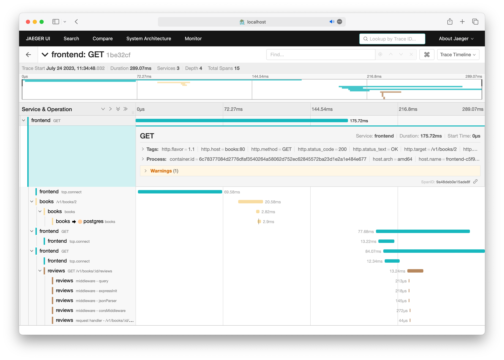

# OpenTelemetry Operator

Attempt to get it up and running with given sample application in local kind based cluster

Main inspiration taken from [here](https://www.aspecto.io/blog/opentelemetry-operator/)

Just go thrue `script.sh` and if everything fine you will see something like:

Really cool and promising but adds some noticieable overhead/slowdown and even worthe - stuck, seems like need check it out little bit later

## Links

- https://youtube.com/watch?v=wyLqXjp4lXI&feature=share
- https://github.com/open-telemetry/opentelemetry-operator
- https://opentelemetry.io/docs/kubernetes/operator/
- https://www.aspecto.io/blog/opentelemetry-operator/
- https://medium.com/@magstherdev/opentelemetry-operator-d3d407354cbf
